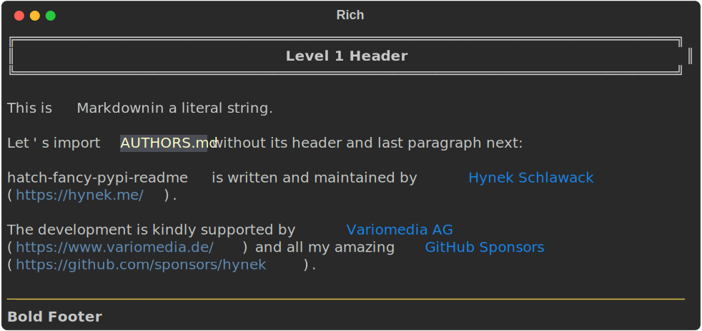

# Your ✨Fancy✨ Project Deserves a ✨Fancy✨ PyPI Readme! 🧐

[](https://pypi.org/project/hatch-fancy-pypi-readme)
[](https://pypi.org/project/hatch-fancy-pypi-readme)
[](https://github.com/pypa/hatch)
[](https://github.com/hynek/hatch-fancy-pypi-readme/blob/main/LICENSE.txt)

*hatch-fancy-pypi-readme* is a [*Hatch*] metadata plugin for everyone who cares about the first impression of their project’s PyPI landing page.
It allows you to define your PyPI project description in terms of concatenated fragments that are based on **static strings**, **files**, and most importantly:
**parts of files** defined using **cut-off points** or **regular expressions**.

Once you’ve assembled your readme, you can additionally run regular-expression substitutions over it. For instance to make relative links absolute or to linkify users and issue numbers in your changelog.

Do you want your PyPI readme to be the project readme, but without badges, followed by the license file, and the changelog section for *only the last* release?
You’ve come to the right place!

> **Note**
> “PyPI project description”, “PyPI landing page”, and “PyPI readme” all refer to the same thing.
> In *setuptools* it’s called `long_description` and is the text shown on a project’s PyPI page.
> We refer to it as “readme” because that’s how it’s called in [PEP 621](https://peps.python.org/pep-0621/)-based `pyproject.toml` files.


### Showcases

<!-- Please add your project in alphabetic order, except leave hatch-fancy-pypi-readme last. -->
- [*jsonschema*](https://pypi.org/project/jsonschema/) ([`pyproject.toml`](https://github.com/python-jsonschema/jsonschema/blob/main/pyproject.toml))
- [*pytermgui*](https://pypi.org/project/pytermgui/) ([`pyproject.toml`](https://github.com/bczsalba/pytermgui/blob/master/pyproject.toml))
- And finally [*hatch-fancy-pypi-readme*](https://pypi.org/project/hatch-fancy-pypi-readme/22.5.0/) 22.5.0 ([`pyproject.toml`](https://github.com/hynek/hatch-fancy-pypi-readme/blob/1a76f0d6cb78448e59466716ee3d5b5ea99915d1/pyproject.toml#L125-L168)), before we went back to a static one to prevent a circular dependency that’s problematic in some cases.

<!-- start docs -->

Feel free to [open a PR](https://github.com/hynek/hatch-fancy-pypi-readme/edit/main/README.md) to add *your* ✨fancy✨ project!


## Motivation

The main reason for my (past) hesitancy to move away from `setup.py` files is that I like to make my PyPI readmes a lot more interesting, than what static strings or static files can offer me.

For example [this](https://github.com/python-attrs/attrs/blob/b3dfebe2e10b44437c4f97d788fb5220d790efd0/setup.py#L110-L124) is the code that gave me the PyPI readme for [*attrs* 22.1.0](https://pypi.org/project/attrs/22.1.0/).
Especially having a summary of the *latest* changes is something I’ve found users to appreciate.

[*Hatch*]’s extensibility finally allowed me to build this plugin that allows you to switch away from `setup.py` without compromising on the user experience.
Now *you* too can have fancy PyPI readmes – just by adding a few lines of configuration to your `pyproject.toml`.


## Configuration

*hatch-fancy-pypi-readme* is, like [*Hatch*], configured in your project’s `pyproject.toml`.

First you add *hatch-fancy-pypi-readme* to your `[build-system]`:

```toml
[build-system]
requires = ["hatchling", "hatch-fancy-pypi-readme"]
build-backend = "hatchling.build"
```

Next, you tell the build system that your readme is dynamic by adding it to the `project.dynamic` list:

```toml
[project]
# ...
dynamic = ["readme"]
```

> **Note**:
> Don’t forget to remove the old `readme` key!

Next, you add a `[tool.hatch.metadata.hooks.fancy-pypi-readme]` section.

Here, you **must** supply a `content-type`.
Currently, only `text/markdown` and `text/x-rst` are supported by PyPI.

```toml
[tool.hatch.metadata.hooks.fancy-pypi-readme]
content-type = "text/markdown"
```


### Fragments

Finally, you also **must** supply an *array* of `fragments`.
A fragment is a piece of text that is appended to your readme in the order that it’s specified.

We recommend *TOML*’s [syntactic sugar for arrays of wrapping the array name in double brackets](https://toml.io/en/v1.0.0#array-of-tables) and will use it throughout this documentation.


#### Text

Text fragments consist of a single `text` key and are appended to the readme exactly as you specify them:

```toml
[[tool.hatch.metadata.hooks.fancy-pypi-readme.fragments]]
text = "Fragment #1"

[[tool.hatch.metadata.hooks.fancy-pypi-readme.fragments]]
text = "Fragment #2"
```

results in:

```
Fragment #1Fragment #2
```

Note that there’s no additional space or empty lines between fragments unless you specify them.


#### File

A file fragment reads a file specified by the `path` key and appends it:

```toml
[[tool.hatch.metadata.hooks.fancy-pypi-readme.fragments]]
path = "AUTHORS.md"
```

Additionally it’s possible to cut away parts of the file before appending it:

- **`start-after`** cuts away everything before the string specified.
- **`end-before`** cuts away everything after.
- **`pattern`** takes a [*regular expression*](https://docs.python.org/3/library/re.html) and returns the first group from it (you probably want to make your capture group non-greedy by appending a question mark: `(.*?)`).
  Internally, it uses

  ```python
  re.search(pattern, whatever_is_left_after_slicing, re.DOTALL).group(1)
  ```

  to find it.

Both *Markdown* and *reST* have comments (`<!-- this is a Markdown comment -->` and `.. this is a reST comment`) that you can use for invisible markers:

```markdown
# Boring Header

<!-- cut after this -->

This is the *interesting* body!

<!-- but before this -->

Uninteresting Footer
```

together with:

```toml
[[tool.hatch.metadata.hooks.fancy-pypi-readme.fragments]]
path = "path.md"
start-after = "<!-- cut after this -->\n\n"
end-before = "\n\n<!-- but before this -->"
pattern = "the (.*?) body"
```

would append:

```markdown
*interesting*
```

to your readme.

> **Note**
>
> - You can insert the same file **multiple times** – each time a different part!
> - The order of the options in a fragment block does *not* matter.
>   They’re always executed in the same order:
>
>   1. `start-after`
>   2. `end-before`
>   3. `pattern`

For a complete example, please see our [example configuration][example-config].


## Substitutions

After a readme is assembled out of fragments, it’s possible to run an arbitrary number of [*regular expression*](https://docs.python.org/3/library/re.html)-based substitutions over it:

```toml
[[tool.hatch.metadata.hooks.fancy-pypi-readme.substitutions]]
pattern = "This is a (.*) that we'll replace later."
replacement = 'It was a "\1"!'
ignore-case = true  # optional; false by default
```

---

Substitutions are for instance useful for replacing relative links with absolute ones:

```toml
[[tool.hatch.metadata.hooks.fancy-pypi-readme.substitutions]]
# Literal TOML strings (single quotes) need no escaping of backslashes.
pattern = '\[(.+?)\]\(((?!https?://)\S+?)\)'
replacement = '[\1](https://github.com/hynek/hatch-fancy-pypi-readme/tree/main\g<2>)'
```

Or expanding GitHub issue/pull request IDs to links:

```toml
[[tool.hatch.metadata.hooks.fancy-pypi-readme.substitutions]]
# Regular TOML strings (double quotes) do.
pattern = "#(\\d+)"
replacement = "[#\\1](https://github.com/hynek/hatch-fancy-pypi-readme/issues/\\1)"
```


## CLI Interface

For faster feedback loops, *hatch-fancy-pypi-readme* comes with a CLI interface that takes a `pyproject.toml` file as an argument and renders out the readme that would go into respective package.

Your can run it either as `hatch-fancy-pypi-readme` or `python -m hatch_fancy_pypi_readme`.
If you don’t pass an argument, it looks for a `pyproject.toml` in the current directory.
You can optionally pass a `-o` option to write the output into a file instead of to standard out.

Since *hatch-fancy-pypi-readme* is part of the isolated build system, it shouldn’t be installed along with your projects.
Therefore we recommend running it using [*pipx*](https://pypa.github.io/pipx/):


```shell
pipx run hatch-fancy-pypi-readme
```

---

You can pipe the output into tools like [*rich-cli*](https://github.com/Textualize/rich-cli#markdown) or [*bat*](https://github.com/sharkdp/bat) to verify your markup.

For example, if you run

```shell
$ pipx run hatch-fancy-pypi-readme | pipx run rich-cli --markdown --hyperlinks -
```

with our [example configuration][example-config], you will get the following output:



> **Warning**
> While the execution model is somewhat different from the [*Hatch*]-Python packaging pipeline, it uses the same configuration validator and text renderer, so the fidelity should be high.
>
> It will **not** help you debug **packaging issues**, though.
>
> To verify your PyPI readme using the full packaging pipeline, check out my [*build-and-inspect-python-package*](https://github.com/hynek/build-and-inspect-python-package) GitHub Action.

<!-- end docs -->

## Project Links

- **License**: [MIT](LICENSE.txt)
- **Documentation**:  https://github.com/hynek/hatch-fancy-pypi-readme#readme
- **Changelog**: [CHANGELOG.md](CHANGELOG.md)
- **PyPI**: https://pypi.org/project/hatch-fancy-pypi-readme/
- **Source Code**: https://github.com/hynek/hatch-fancy-pypi-readme
- **Supported Python Versions**: 3.7 and later (follows [*Hatch*])

[example-config]: tests/example_pyproject.toml
[*Hatch*]: https://hatch.pypa.io/
